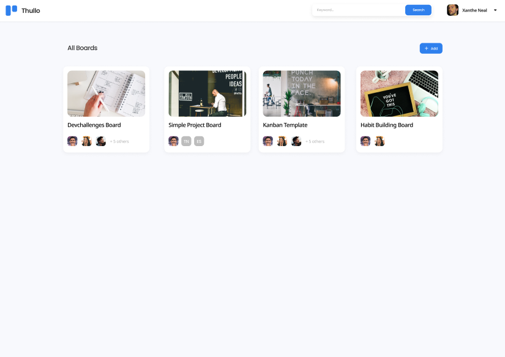
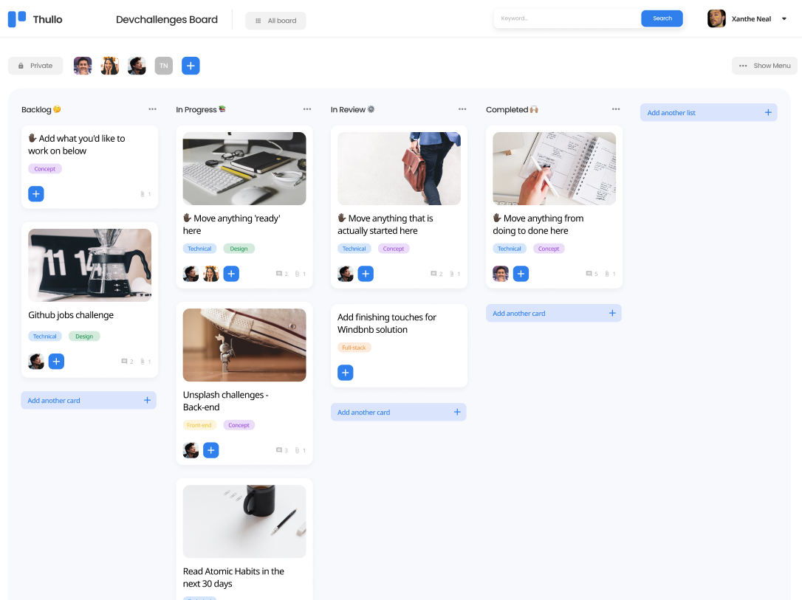

# Thullo - Task and Project Management Application (WIP)

Thullo is a feature-rich task and project management application designed to streamline your workflow. With a user-friendly interface and a powerful set of features, Thullo helps you organize your tasks, collaborate with your team, and stay on top of your projects.


## Table of Contents

-   [Screenshots](#screenshots)
-   [Features](#features)
-   [Tech Stack](#tech-stack)
-   [Installation](#installation)
-   [Usage](#usage)
-   [Contributing](#contributing)
-   [License](#license)

## Screenshots




## Features

Thullo offers a wide range of features to make your task and project management efficient and effective. Here are some of the key user stories we have implemented:

1. **List of Available Boards**:

    - View a list of available boards on your dashboard.

2. **Create New Boards**:

    - Add new boards with a cover photo, title, and visibility options.

3. **Board Details**:

    - View a board with different columns, team members, and other relevant information according to the design.

4. **Create Lists**:

    - Add new lists to organize your tasks and projects.

5. **Add Cards to Lists**:

    - Add new cards to existing lists.

6. **Board Visibility**:

    - Set the visibility of the board as per your preferences.

7. **Add Members**:

    - Add members to the board (users must exist in the system).

8. **Edit Board Name**:

    - Change the name of the board by selecting it.

9. **Edit Board Description**:

    - Change or add descriptions to the board.

10. **Remove Members** (Admin only):

    - Remove members from the board if you have admin privileges.

11. **Drag and Drop Cards**:

    - Easily move cards from one column to another using drag and drop.

12. **Card Details**:
    - When a card is selected, you can:
        - Rename the title.
        - See which column the card belongs to.
        - View and change the description.
        - Add new attachments and manage existing attachments.
        - Add comments, edit, and delete them.
        - Change the card cover image by searching from Unsplash.
        - Add labels with various colors.

## Tech Stack

Thullo is built using the following technologies and libraries:

-   **Next.js**: A React framework for building efficient and scalable web applications.
-   **Sass**: A powerful CSS preprocessor for styling the application.
-   **Ant Design**: A UI library for React that provides a set of high-quality components.
-   **Zustand**: A state management library for React applications.
-   **Firebase**: A cloud-based platform for developing web and mobile applications.
-   **DND Kit**: A library for implementing drag-and-drop interactions.

## Installation

To run Thullo locally, follow these steps:

1. Clone the repository:

    ```bash
    git clone https://github.com/vishwa-akshat/thullo.git
    ```

2. Navigate to the project directory:

    ```bash
    cd thullo
    ```

3. Install dependencies:

    ```bash
    npm install
    ```

4. Configure Firebase:

    - Create a Firebase project and obtain your Firebase configuration.
    - Add the configuration to the appropriate Firebase initialization file in the project.

5. Start the development server:

    ```bash
    npm run dev
    ```

6. Open your web browser and visit [http://localhost:3000](http://localhost:3000) to access Thullo.

## Usage

1. Create an account or log in to your existing account.
2. Start by creating a new board, customizing it as needed.
3. Add lists to the board to represent different project stages.
4. Populate the lists with cards for your tasks or project items.
5. Collaborate with team members by adding them to the board.
6. Use the drag-and-drop functionality to manage and prioritize your tasks.
7. Click on cards to view and edit their details, including titles, descriptions, attachments, comments, and more.

---
